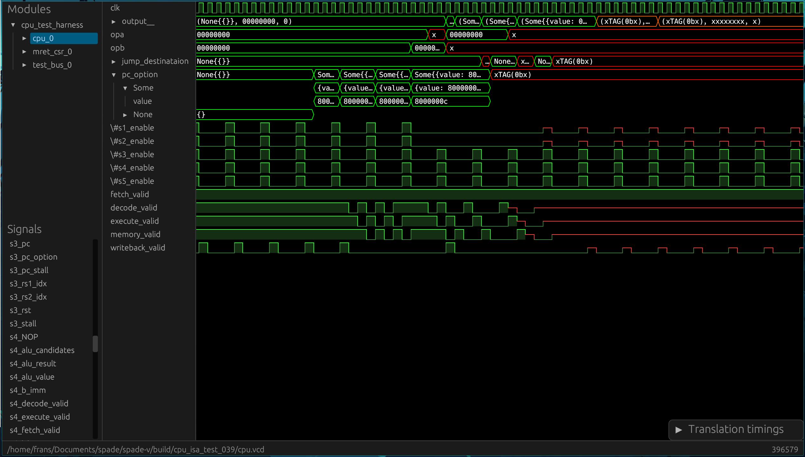

# Surfer

A VCD viewer with a focus on a snappy usable interface, and extensibility



## Installation

If you just want to try things out, you can try surfer right in the web-browser
at https://app.surfer-project.org/. However, performance is a bit worse than
native, and some features are missing so for day-to-day use it is recommended
to install the native version.


The primary way to install surfer to build it from source which should work on
Linux, Mac and Windows. For convenience we also provide a pre-built Linux
binary.

### Compiling from source

Surfer depends on openssl, install it via your package manager

#### Debian/Ubuntu
```bash
$sudo apt install openssl
$sudo apt install libssl-dev
```

#### Fedora
```bash
$sudo dnf install openssl
$sudo dnf install openssl-devel
```

#### Arch
```bash
$sudo pacman -S openssl
```

Then, install [Rust via Rustup](https://rustup.rs) and run
```bash
cargo install --git https://gitlab.com/surfer-project/surfer surfer
```

### Pre-built linux binary


You can download a pre-built linux binary
[here](https://gitlab.com/api/v4/projects/42073614/jobs/artifacts/main/download?job=linux_build).
It is built on a debian system with some dynamically linked libs, so it may
not work on all systems.

### Pre-built Windows binary
You can download a pre-built linux binary
[here](https://gitlab.com/api/v4/projects/42073614/jobs/artifacts/main/download?job=windows_build).


## Project Status

Surfer is still in early development, but it is in a usable state. In fact, if
you are able to take advantage of the extensibility such as with the
[Spade](https://spade-lang.org) integration, you may even prefer it to the alternatives.

As an indication of the status of the project, here is an incomplete list of supported and planned features

- [x] Basic rendering of waves
- [x] Snappy zooming, panning and general interaction
- [x] VCD loading
- [ ] FST loading
- [x] [Fuzzy completion based command line interface](misc/surfer_ui_trimmed.mp4)
- [x] Bit translation
  - [x] Raw bits
  - [x] Hexadecimal values
  - [x] Unsigned values
  - [x] [Spade](https://spade-lang.org) values
  - [x] Signed values
  - [x] Octal values
  - [x] VHDL nine-valued std_ulogic support
  - [x] ASCII
  - [x] Floating-point
    - [ ] IEEE 754 binary128 (quad)
    - [x] IEEE 754 binary64 (double)
    - [x] IEEE 754 binary32 (single)
    - [x] IEEE 754 binary16 (half), using [half](https://docs.rs/half/)
    - [x] bfloat16, using [half](https://docs.rs/half/)
    - [x] 8-bit E5M2
    - [x] 8-bit E4M3
  - [x] Posit, using [softposit](https://docs.rs/softposit/)
    - [x] 32-bit, two exponent bits
    - [x] 16-bit, one exponent bit
    - [x] 8-bit, no exponent bit
    - [ ] Quire for 32-bit, two exponent bits
    - [x] Quire for 16-bit, one exponent bit
    - [x] Quire for 8-bit, no exponent bit
  - [x] Risc-V instructions
    - [x] RV32I
    - [ ] ...
  - [ ] Compressed integers
    - [x] LEB128 (also for other bitwidths than 128)
  - [ ] Custom translation via Python API
- [x] Dividers 
- [ ] Wave file reloading
- [ ] Saving and loading selected waves
- [x] Cursors for measuring time
- [x] Mouse gesture control
- [x] Keyboard commands
- [ ] [WAL](https://wal-lang.org) integration

## License

Surfer is licensed under the [EUPL-1.2 license](LICENSE.txt).
